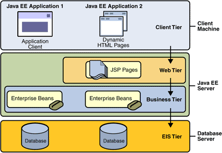

#  Práctica N° 1
## Sistemas Empresariales 

**Carrera:**                Ingeniería de Sistemas 
**Materia:**                Tecnologías Emergentes II 
**Apellidos y Nombres:**    Condori Mamani Elias 
**C.I.:**                   9179995 LP. 
**Lugar y Fecha:**          El Alto, 13/08/19 

1.  Explique que son los sistemas empresariales

    Es generalmente cualquier tipo de sistema de computación que es de "clase
    enterprise". Esto significa normalmente que ofrece alta calidad de servicio,
    trabaja con grandes volúmenes de datos capaz de soportar cualquier
    organización grande ("enterprise").

2.  Describa cuales son las características más importantes de una aplicación
    empresarial

    Un sistema de información empresarial debe ser eficaz y eficiente. Es eficaz
    si facilita la información necesaria, y es eficiente si lo realiza con los
    menores recursos posibles.

    Un SIE debe adaptarse a las necesidades concretas de cada organización y
    a su estructura organizativa. Cuando se piensa en una implantación nunca
    se parte de cero pues todas las empresas disponen de algún tipo de
    información, con distintos grados de calidad/fiabilidad y con niveles de
    accesibilidad mayores o menores, etc. Esa información debe contemplarse
    como parte del SIE.

3.  Investigue y proponga cinco (5) instituciones que requerirían aplicaciones
    de misión crítica. Justifique su respuesta.
    
    Hoy en día culaquier organización o empresa de gran tamaño requerirían los sistemas
    de misión crítica, esto, debido a que los clientes incrementan haciendo uso del
    sistema, por lo cual ninguna organización puede dejar de brindar una buena experiencia 
    a sus clientes.

4.  Explique cuáles son las diferencias entre la escalabilidad horizontal y
    escalabilidad vertical

    La escalabilidad vertical, significa el añadir más recursos a un solo nodo
    en particular dentro de un sistema, tal como el añadir memoria o un disco
    duro más rápido a una computadora.

    La escalabilidad horizontal, significa agregar más nodos a un sistema, tal
    como añadir una computadora nueva a un programa de aplicación para espejo.

    Entonces, la diferencia radica en que con la escalabilidad vertical se añade
    mas potencia a un nodo de un sistema, en cambio, con la escalabilidad
    horizontal se añade nodos nuevos, y no así mas potencia a un nodo.

5.  Que es un servidor Web y que es un servidor de aplicaciones

    Un servidor Web es un programa informático que procesa una aplicación del
    lado del servidor, es decir, este servidor
    sirve de contenido a la web mediante protocolo http.

    Un servidor de aplicaciones alberga y expone la lógica de negocio y procesos.

    Creo que el punto principal es que el servidor web expone todo a través del protocolo
    http, mientras que el servidor de aplicaciones no se limita a él.

    Dicho esto, en muchos casos que se encontrará que el servidor web se está
    utilizando para crear el front-end del servidor, es decir, expone un
    conjunto de páginas web que permiten interactuar al usuario con las reglas
    de negocio encontradas en el servidor de aplicaciones.

6.  Con un gráfico explique cómo funciona el protocolo HTTP

    -   El usuario introduce la url en el navegador

    -   El navegador o cliente http decodifica la información obteniendo el esquema
        o protocolo, la IP o el nombre del servidor web, puerto, etc.

    -   El cliente conecta con el servidor web y le solicita la página web. Petición
        HTTP (Request).

    -   El servidor envía la página web o devuelve el código de error
        correspondiente. Respuesta HTTP (Response).

    -   Navegador o cliente http interpreta los códigos html recibidos y visualiza
        el resultado.

    -   Se cierra la conexión.

        

        Por lo tanto, cuando se establece una conexión HTTP tenemos dos tipos de
        mensajes entre un cliente y un servidor: una petición por parte del cliente
        y una respuesta por parte del servidor.

        Si el navegador solicita una página web con 2 imágenes, van a existir 3
        conexiones: Una para solicitar la página web y dos para las imágenes.

7.  Explique los elementos importantes de REQUEST en HTTP

       Un simple mensaje de request de un cliente tiene los siguientes elementos:

       Una línea de request para obtener el recurso, por ejemplo un request con el método GET /content/page1.html está requiriendo el recurso llamado /content/page1.html del servidor.

       Encabezados. Indican cosas como el lenguaje, codificación, tipo de datos (XML,JSON, etc). (Por ejemplo– Accept-Language: EN).

       Una línea vacía.

       Un cuerpo del mensaje que es opcional. Entre aplicaciones esta es la parte más importante. Por ejemplo, yo puedo enviar un XML o un JSON a otra máquina, y el servidor web interpretara la información que yo le mando.

       Todas las líneas terminan con un retorno de carro y nueva línea. La línea vacía sólo contiene el retorno de carro y la nueva línea sin espacios.

8.  Explique los elementos importantes de RESPONSE en HTTP

       Un simple response del servidor web contiene lo siguiente:

       HTTP Status Code (Por ejemplo, HTTP/1.1 301 Movido Permanentemente,
        significa que el recurso requerido fue movido permanentemente y redirigido a
        otro recurso).

       Encabezados. Igual que en el request, describen el contenido del response
        (Example – Content-Type: html)

       Una línea vacía.

       Un cuerpo de mensaje, que es opcional. Cuando trabajamos con aplicaciones,
        aquí puede venir la respuesta en XML u otro formato. Cuando es una página
        del navegador, contiene el código HTML que forma nuestra página.

       Todas las líneas terminan con un retorno de carro y nueva línea. La línea
        vacía sólo contiene el retorno de carro y la nueva línea sin espacios.

9.  Describa con un gráfico la arquitectura Java EE

    

    >   Java EE proporciona una arquitectura multi-capa. La capa cliente puede estar constituida por aplicaciones Java de escritorio o navegadores HTML. Las capas proporcionadas por Java EE propiamente dicha son las capas Web (mediante las tecnologías Servlets, JSP y JSF) y las capas de Negocio (mediante tecnologías como EJB, JMS o Web Services). Por último, estas capas se comunican con una capa de datos (base de datos o aplicaciones y sistemas legacy).

10.  Explique cuáles son los contenedores, componentes y servicios de Java EE

     **CONTENEDORES JAVA EE**

        Java EE Server: La porción de tiempo de ejecución de un producto Java EE, provee los contenedores web y de ejb.

        Contenedor EJB: Maneja la ejecución de los enterprise beans.

        Contenedor Web: Maneja la ejecución de las páginas web, servlets y algunos componentes ejb para las aplicaciones Java EE.

        Contenedor de aplicación cliente: Maneja la ejecución de la aplicación cliente no necesita un servidor de aplicaciones.

        Contenedor Applet: Maneja la ejecución de applets, no necesita servidor de aplicaciones, consiste en un browser y el plugin web de java.

     **COMPONENTES JAVA EE**

        Una aplicación Java EE esta creada de componentes. 
     
        Un componente de Java EE es una unidad autónoma de software funcional que se ensambla en una aplicación Java EE con sus clases y archivos relacionados y que se comunica con otros componentes. Las especificaciones Java EE define los siguientes componentes.
     
       Las aplicaciones cliente y los applets son componentes que se ejecutan en el cliente. Java Servlet,JavaServer Faces y JavaServer Pages son componentes Web que se ejecutan en el servidor. Enterprise JavaBeans (EJB) son componentes de negocio que se ejecutan en el servidor. La diferencia entre los componentes de Java EE y las clases de Java estándar es que los componentes son ensamblados en una aplicación JEE y se verifica que estén bien creados y que cumplan con las especificaciones JEE. Se despliegan a la producción, donde se ejecutan y gestionan por el servidor Java EE.

     **SERVICIOS DE JAVA EE**

     -   JOnAS, un servidor de aplicaciones de código abierto de ObjectWeb.

     -   JBoss, desarrollado inicialmente por JBoss Inc y adquirido posteriormente
        por Red Hat. Existe una versión de código abierto soportada por la comunidad
        y otra empresarial.

     -   Sun Java System Application Server Platform Edition 9.0, basado en
        GlassFish.

     -   Oracle WebLogic Application Server 10.0 (Antes BEA Systems).

     -   Servidor de Aplicaciones SAP NetWeaver, Java EE 5 Edition de SAP.

     -   JEUS 6, un Servidor de aplicaciones específico de Linux de TmaxSoft.

     -   Apache Geronimo 2.0

     -   IBM WebSphere Application Server.

     -   Oracle Containers for Java EE 11.

     -   GlassFish, un servidor de aplicaciones de código abierto de Sun.

     -   Apache OpenEJB via Apache Geronimo.

11.  Investigue los métodos más utilizados de las clases HttpServlet, HttpServletRequest y HttpServletResponse, y para cada uno de los métodos muestre un ejemplo.

     **HttpServlet:**

     >   **public abstract class HttpServlet extends GenericServlet**: Es la clase de la cual se debe extender para crear un servlet HTTP. De la clase que extiende obtiene los métodos ya definidos además de los cuales define:

     **doGet(HttpServletRequest req, HttpServletResponse resp)**: Es el método llamado para procesar información que haya sido enviado con el método GET. Este método es llamado concurrentemente para cada cliente por lo que hay que estar atento por posibles variables compartidas que causen problemas.

     **Ejemplo:**

     >  import java.io.IOException;
     >
     >  import java.io.PrintWriter; 
     >
     >   import javax.servlet.ServletException; 
     >
     >   import javax.servlet.http.HttpServletRequest; 
     >
     >   import javax.servlet.http.HttpServletResponse; 
     >
     >   public class MiPrimerServlet extends javax.servlet.http.HttpServlet implements javax.servlet.Servlet {        
     >> private static final long serialVersionUID = 1L; 
     >>
     >> public MiPrimerServlet() { 
     >>>   super(); 
     >>>
     >> }
     >> 
     >> protected void doGet(HttpServletRequest request, HttpServletResponse response) throws ServletException, IOException { 
     >>
     >>>  PrintWriter out;
     >>> 
     >>>  out = response.getWriter(); 
     >>>  response.setContentType("text/html"); 
     >>>  out.println("\<html\>"); 
     >>>  out.println("\<head\>\<title\>Mi Primer Servlet \</title\>\</head\>"); 
     >>>  out.println("\<body\>"); 
     >>>  out.println("Este es mi Primer Servlet"); 
     >>>  out.println("\</body\>\</html\>"); 
     >>>
     >>  } 
     >>
     >} 
-   **doPost(HttpServletRequest req, HttpServletResponse resp)**: Ídem al anterior pero para el método POST, en general se implementa sólo un método y el otro lo referencia.

     **Ejemplo**:

    >   import java.io.IOException; 
    >
    >   import java.io.PrintWriter; 
    >
    >   import javax.servlet.ServletException; 
    >
    >   import javax.servlet.http.HttpServletRequest; 
    >
    >   import javax.servlet.http.HttpServletResponse; 
    >
    >   public class MiPrimerServlet extends javax.servlet.http.HttpServlet implements javax.servlet.Servlet { 
        >>  private static final long serialVersionUID = 1L; 
        >>
        >>  public MiPrimerServlet() { 
            >>> super(); 
            >>>
        >>  }
        >>
        >>  protected void doPost(HttpServletRequest request, HttpServletResponse response) throws ServletException, IOException { 
            >>>
            >>> PrintWriter out; 
            >>>
            >>> out = response.getWriter();
            >>>
            >>> response.setContentType("text/html");
            >>>
            >>> out.println("\<html\>"); out.println("\<head\>\<title\>Mi Primer Servlet \</title\>\</head\>"); 
            >>>
            >>> out.println("\<body\>"); 
            >>>
            >>> out.println("Este es mi Primer Servlet"); 
            >>>
            >>> out.println("\</body\>\</html\>");
            >>> 
            >>  }
            >> 
            > }

    **HttpServletRequest:**

    >   **public abstract interface HttpServletRequest extends ServletRequest:** Permite obtener del cliente la información que es dependiente del protocolo, en este caso HTTP. Entre sus métodos están:

    -   **getHeader(String name):** Permite obtener el valor de los Headers de HTTP
        con que fue llamado el servlet.

    **Ejemplo:**

        String sIP = request.getHeader("X-FORWARDED-FOR");

    -   **getCookies():** Retorna un arreglo que contiene todas las *cookies* que el
        cliente envía al servlet.

    -   **getSession():** Retorna la sesión en la cual se encuentra el cliente.

    **Ejemplo:**

    >>  protected void doGet(HttpServletRequest request, HttpServletResponse response) throws ServletException, IOException { 
        >>>
        >>>HttpSession session = request.getSession(); 
        >>>
        >>>session.setMaxInactiveInterval(20\*60); 
        >>>
    >>}

    **HttpServletResponse:**

    >   **public abstract interface HttpServletResponse extends ServletResponse:** Permite enviar al cliente respuestas específicas del protocolo HTTP.

    -   **addCookie(Cookie cookie):** Para definir nuevas *cookies* en el cliente.

    -   **setHeader(String name, String value):** Para definir un header HTTP a
        enviar al cliente.

    -   **sendRedirect(String location):** Envía un mensaje al cliente para
        redireccionar la respuesta a la dirección señalada.

    **Ejemplo:**

        \<% response.sendRedirect("<http://www.google.com/>"); %\>
